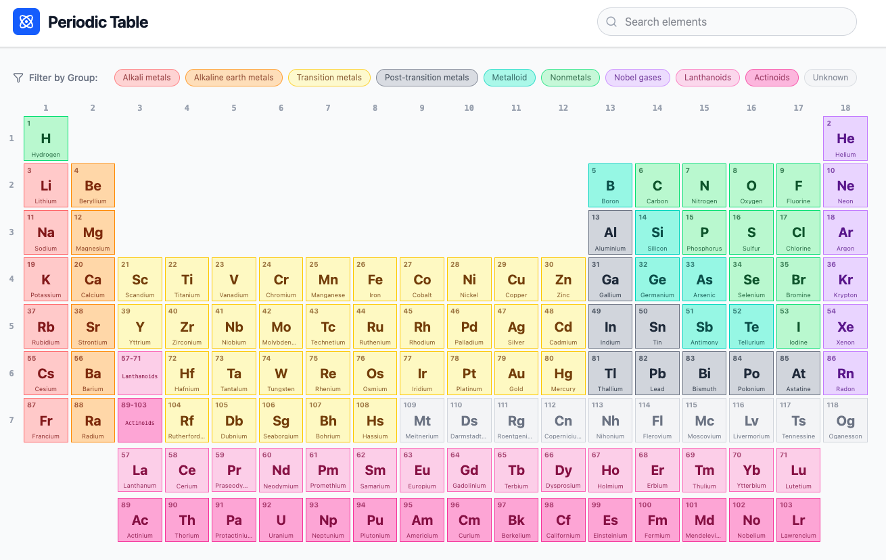

## Interactive Periodic Table

An interactive **periodic table of elements** built with **React**, **Vite**, and **Tailwind CSS**.

It supports:
- **Color‑coded groups** (alkali metals, noble gases, nonmetals, lanthanoids, actinoids, etc.)
- **Filter by group** (using the colored chips above the table)
- **Search by name, symbol, or atomic number**
- Proper layout with **group numbers (1–18)** and **period numbers (1–7)**
- **Lanthanoids (57–71)** and **Actinoids (89–103)** shown in separate rows, with clickable placeholders in the main table
- A **detail modal** when you click any element

The app is deployed to **GitHub Pages** from this repository.

---

## Screenshot


```markdown

```

---

## Getting Started

### 1. Install dependencies

```bash
npm install
```

### 2. Run the dev server

```bash
npm run dev
```

Then open the URL Vite prints in the terminal (usually `http://localhost:5173`).

### 3. Build for production

```bash
npm run build
```

The static files are output to the `dist` folder.

---

## GitHub Pages Deployment

This project is configured to deploy to GitHub Pages at:

- `https://changzhiai.github.io/PeriodicTable/`

Key settings:
- `vite.config.js` has `base: '/PeriodicTable/'`.
- GitHub Actions workflow at `.github/workflows/deploy.yml`:
  - Builds the app on pushes to `main`
  - Publishes the `dist` folder to GitHub Pages

Once changes are committed and pushed to `main`, GitHub Pages will update automatically.

---

## Tech Stack

- **React** (functional components, hooks)
- **Vite** (bundler/dev server)
- **Tailwind CSS v4** for styling
- **lucide-react** for icons

---

## Contact

If you have questions or suggestions about this project, please contact: changzhiai@gmail.com
