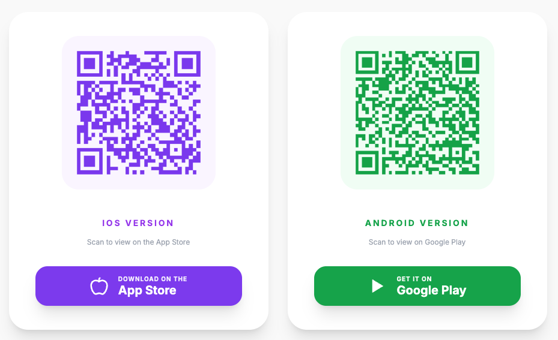
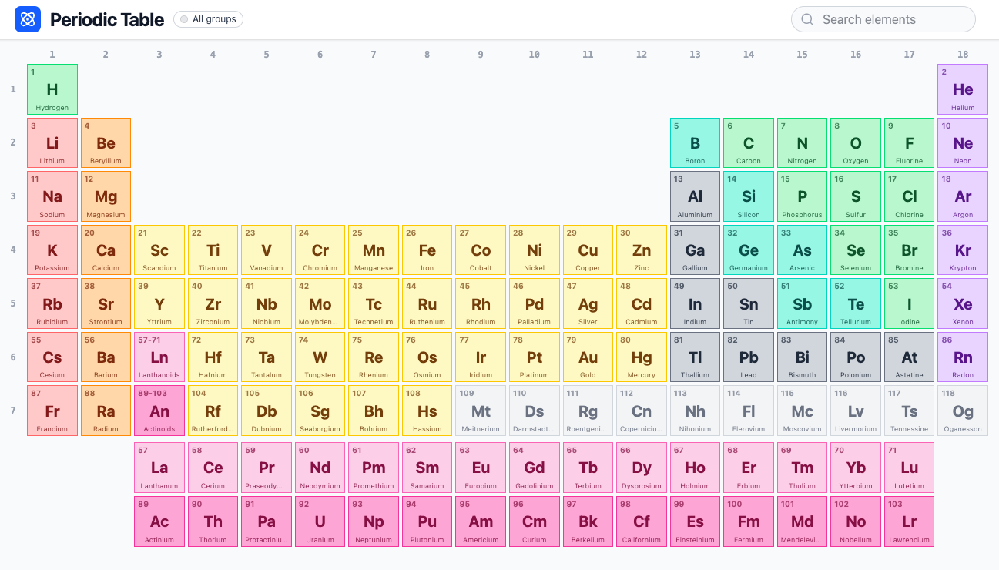

## Interactive Periodic Table

An modern and interactive **Periodic Table of Elements** with comprehensive information, including physical properties, electron configurations, 3D electron shell models, 3D atomic models, and more. Unlock the building blocks of the universe with the most modern, comprehensive, and interactive Periodic Table on the web, iOS, and Android platforms. Designed for students, educators, and science enthusiasts, this app transforms a static chart into a dynamic educational powerhouse. From high-school chemistry to professional research, this is the only reference tool you will ever need.

It supports:
- **Color‑coded groups** (alkali metals, noble gases, nonmetals, Lanthanides, Actinides, etc.)
- **Filter by group** (using the colored chips above the table)
- **Search by name, symbol, or atomic number**
- Proper layout with **group numbers (1–18)** and **period numbers (1–7)**
- **Lanthanides (57–71)** and **Actinides (89–103)** shown in separate rows, with clickable placeholders in the main table
- A **detail modal** when you click any element

## Access

### 1. Web

You can access the website at [https://periodictable.travel-tracker.org/](https://periodictable.travel-tracker.org/)

### 2. Mobile

You can scan the QR code to download the iOS and Android app as follows:

## Main Page

## Features

- **Scientific Precision**: Detailed data for all 118 elements including physical properties, atomic structure, chemical behavior, and thermodynamics.
- **Deep-Dive Summaries**: Real-world uses, discovery history, manufacturing processes, and health/safety info for every element.
- **Stunning Interactive Visuals**:
    - **3D Atomic Models**: Explore atomic orbital structures in an interactive 3D space.
    - **Color-Coded Taxonomy**: Easily identify Alkali Metals, Noble Gases, Transition Metals, and more.
- **Advanced Study Tools**:
    - **Audio Pronunciation**: Master chemistry vocabulary with built-in Web Speech technology.
    - **Powerful Search & Filtering**: Find elements instantly by name, symbol, atomic number, or chemical category.
- **Modern Premium Design**:
    - **Ultra-Responsive UI**: Optimized layouts for mobile, tablet (iPad), and desktop.
    - **Glassmorphic Aesthetics**: Modern, clean design using Tailwind CSS for professional look and feel.
    - **All Platform Support**: Seamless experience across Web, iOS, and Android.

## Contact

If you have questions or suggestions about this project, please contact: changzhiai@gmail.com
